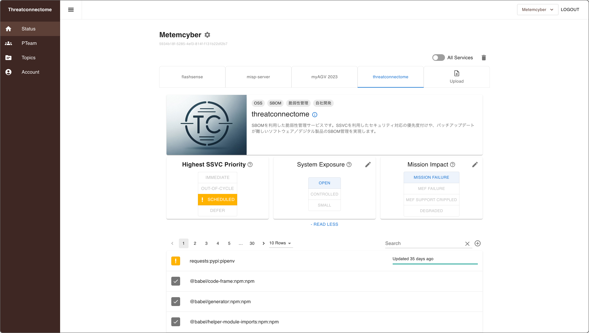

<h3 align="center">Vulnerability Management with SBOM</h3>

<h3 align="center"></h3>

## Threatconnectome

Threatconnectome supports vulnerability management in industries where products are hard to update, such as automotive, manufacturing and communications infrastructure.

- Alerts and Actions based on SSVC
- PSIRT-friendly UI and Web API
- SPDX 2.3 and CycloneDX 1.6 support

## :eyes: Live demo

:warning: Do not input personal information.

https://demo.threatconnectome.metemcyber.ntt.com/

Please login using the following accounts:

- `user1@demo.test`: `gisoi3qy`
- `user2@demo.test`: `gisoi3qy`

Teams registerd in demo environment as following:
| Product Dev Team | Services |
| --- | --- |
| Metemcyber 開発チーム 東京 | Web Service (Django) |
| Metemcyber Dev Team US | Web Service (Django) |

### Demo Limitation

- Data is reset every 1 hour.
- Do not input personal information in demo environment.
- Only python and alpine vulnerability information are saved in demo environment.
- Because of demo instance, not all actual vulnerability information is registered.

## :rocket: Quick Start

Spin up the local demo with the shortest path.

```bash
git clone https://github.com/nttcom/threatconnectome
cd threatconnectome
./demo_start.sh
```

> To stop the services:
>
> ```bash
> ./demo_stop.sh
> ```

Make sure Docker (Docker Compose) is installed and running.

Need the full setup guide? See [docs/setup.md](docs/setup.md).

Planning a Supabase-backed deployment? Follow [docs/setup_supabase.md](docs/setup_supabase.md).
