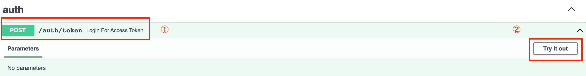
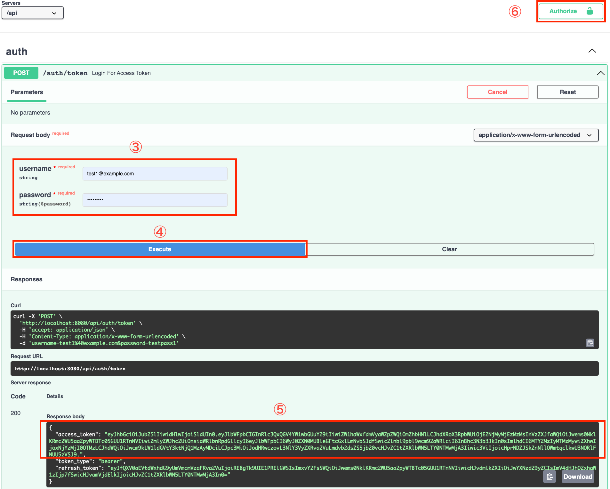
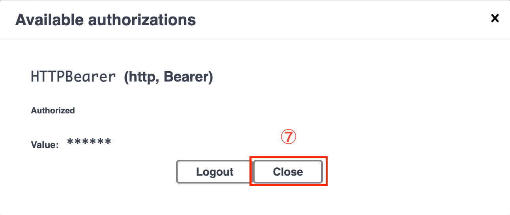
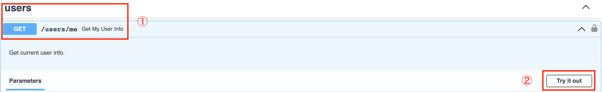
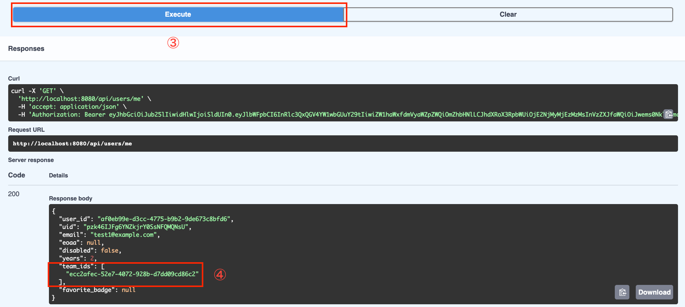
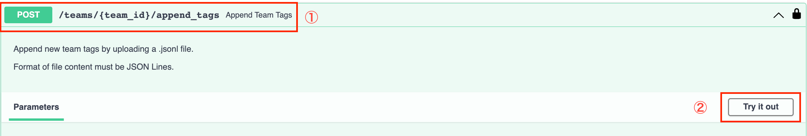
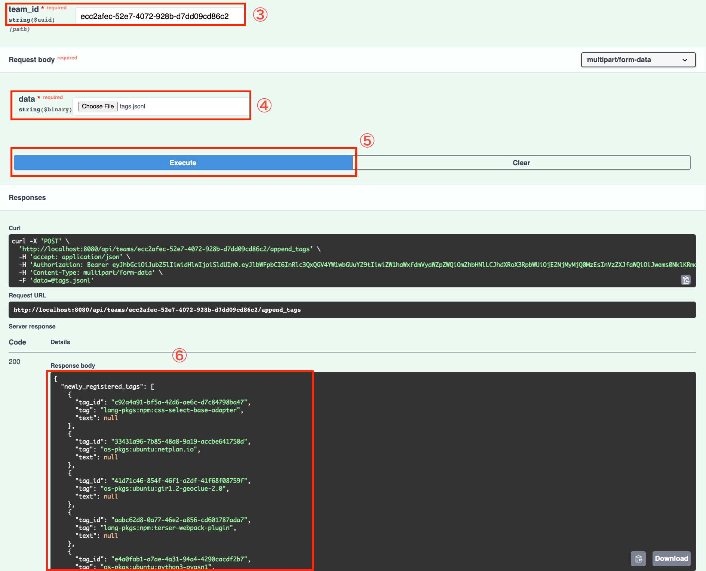
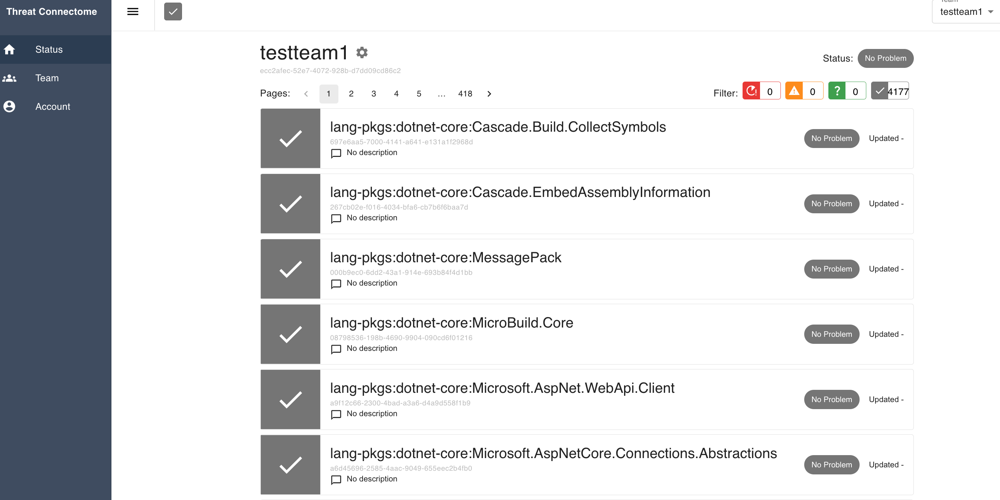

# :bulb: Tag Registration

Purpose: To inspect packages (OS packages & library packages) used in a user's server by Trivy, register them with Threatconnectome and manage their security status.

## :bangbang: Requirements

- `Python3`
- `Trivy`

## :desktop_computer: Preparation

### Account creation

First of all, please make sure you have an account and belong to a team in Threatconnectome. If not, please create one.

For public environment: `http://threatconnectome.metemcyber.ntt.com`

For local environment: `http://localhost:<your_port_for_threatconnectome>`

### Update & Upgrade

Then update outdated packages and dependencies on your system.

```bash
sudo apt-get update && sudo apt-get upgrade
```

## :gear: Trivy Installation

Please run the commands below to install Trivy on Ubuntu:

```bash
sudo apt-get install wget apt-transport-https gnupg lsb-release
wget -qO - https://aquasecurity.github.io/trivy-repo/deb/public.key | gpg --dearmor | sudo tee /usr/share/keyrings/trivy.gpg > /dev/null
echo "deb [signed-by=/usr/share/keyrings/trivy.gpg] https://aquasecurity.github.io/trivy-repo/deb $(lsb_release -sc) main" | sudo tee -a /etc/apt/sources.list.d/trivy.list
sudo apt-get update
sudo apt-get install trivy
```

For users of other OS, please refer to `https://aquasecurity.github.io/trivy/v0.31.3/getting-started/installation/`

## :low_brightness: Osv-Scanner Installation

Please run the commands below to install OSV-Scanner on Ubuntu:

```bash
sudo apt install golang-go
go install github.com/google/osv-scanner/cmd/osv-scanner@latest
```

If setting up PATH, please add the following in `.profile`:

```bash
export GOPATH=$HOME/go
export GOBIN=$GOPATH/bin
export PATH=$PATH:$GOBIN
```

For users of other OS, please refer to `https://github.com/google/osv-scanner`

OSV-Scanner command example:

```bash
osv-scanner -r --json threatconnectome > osv-result.json
```

## :triangular_flag_on_post: Procedures for tag registration in public environment

1. Script Download

Please access `https://github.com/nttcom/threatconnectome/blob/main/scripts/trivy_tags.py`, click the `Raw` button, and save the contents as trivy_tags.py.

2. Run a full scan on all directories

```bash
sudo trivy fs -f json -o trivy-result.json --list-all-pkgs --scanners vuln /
```

:warning: Please make sure `trivy_tags.py` and `trivy-result.json` are in the same directory before next step.

3. Convert scan result to tags

```bash
python3 trivy_tags.py -i trivy-result.json -o tags.jsonl
```

4. Register tags at API:
   Access `https://api.threatconnectome.metemcyber.ntt.com/docs`.

- 4.1 Go to ⇨ `POST /auth/token  Login For Access Token`

Follow the steps below to login and authorize your account.




- 4.2 Scroll down to ⇨ `GET /users/me  Get My User Info`

Get your own `team_id` by following steps and copy it.



- 4.3 Scroll up to ⇨ `POST /pteams/{team_id}/upload_packages_file  Upload Pteam Tags File`

Click `Try it out`, paste `team_id`, specifiy `service` (repository or product), set `force_mode` if needed, click on "choose file" button and choose the `tags.jsonl` generated in procedure 3, then execute.



5. Log in to Web UI

Login to `http://threatconnectome.metemcyber.ntt.com` and choose your team. Tags will be shown on the page of `Status`.


## :triangular_flag_on_post: Procedures for tag registration in local development environment

1. Inspect packages (OS packages & library packages) used in VM by running a full scan on all directories

```bash
sudo trivy fs -f json -o trivy-result.json --list-all-pkgs --scanners vuln /
```

2. Convert scan result to tags

```bash
cd threatconnectome
python scripts/trivy_tags.py -i trivy-result.json -o tags.jsonl
```

3. Start local containers

```bash
sudo docker compose -f docker-compose-local.yml up -d --build
```

4. Register tags at API:
   Access `http://localhost:<your_port_for_threatconnectome>/api/docs`.

- 4.1 Go to ⇨ `POST /auth/token  Login For Access Token`
  Login and authorize your account.

- 4.2 Scroll down to ⇨ `GET /users/me  Get My User Info`
  Get your own `team_id` and copy it.

- 4.3 Scroll up to ⇨ `POST /pteams/{team_id}/upload_tags_file  Upload Pteam Tags File`
  Click `Try it out`, paste `team_id`, specifiy `service` (repository or product), set `force_mode` if needed, click on "choose file" button and choose the `tags.jsonl` generated in procedure 2, then execute.

5. Log in to Web UI

Login to `http://localhost:<your_port_for_threatconnectome>` and choose your team. Tags will be shown on the page of `Status`.

# :bulb: Topic Registration from TrivyDB

Purpose: To create topics from TrivyDB to understand the threat impact of your tags.

## :pushpin: Requirements

```bash
pip install boltdb requests
```

## :triangular_flag_on_post: Usage

Run the following commands to update trivy.db

```bash
trivy image --download-db-only

```

The default path of `trivy.db` is as follows:

- Linux: `~/.cache/trivy/db/trivy.db`
- macOS: `~/Library/Caches/trivy/db/trivy.db`

Run the following commands to create topics from Trivy DB:

```bash
export THREATCONNECTOME_REFRESHTOKEN="XXXXXXXXX"
# For local development environment
python3 trivydb2tc.py -d ~/.cache/trivy/db/trivy.db "http://localhost/api"

```

Use `--force-update` option to update existing topics.

```bash
python3 trivydb2tc.py -d ~/.cache/trivy/db/trivy.db --force-update "http://localhost/api"

```

# :bulb: Topic Update from Vulnrichment

Purpose: To update topics from Vulnrichment to regist exploitation and automatable in topic.

## :triangular_flag_on_post: Usage

Run the following commands to clone vulnrichment

```bash
git clone https://github.com/cisagov/vulnrichment

```

Run the following commands to update topics from vulnrichment:

```bash
export THREATCONNECTOME_REFRESHTOKEN="XXXXXXXXX"
# For local development environment
python3 vulnrichment2tc.py -v vulnrichment

```

# :bulb: Read and parse CycloneDX v1.5 files

Purpose: To parse CycloneDX v1.5 files (Trivy, Syft) and output JSON for Threatconnectome registration.

## :pushpin: Requirements

```bash
pip install packageurl-python
pip install 'cyclonedx-python-lib[json-validation]'
```

## :triangular_flag_on_post: Usage

Run the following commands

```bash
python cdx_tags.py [Options]

```

The available options are as follow:

- -i / --infile: Specifies the input file. If not specified, read from standard input.
- -o / --outfile: Specifies the output file. If not specified, the file is written to standard output.
- -t / --tool: Specifies the tool to use. Supported tools are "syft" and "trivy". If not specified, auto-detection is attempted.
- -r / --replace_rules: Specify replacement rules. You can specify more than one.
- -s / --skip_rules: Skip rules. Multiple skip rules can be specified.
- -H / --hostname: Specify target hostname. If not specified, auto-detection will be attempted under specific conditions.

# :bulb: Colletct tickets data

Run the following commands to colletct tickets data

```bash
export THREATCONNECTOME_REFRESHTOKEN="XXXXXXXXX"
# For local development environment
python3 collect_tickets_data.py -p <pteam_id> -s <service_id> "http://localhost/api"

```
