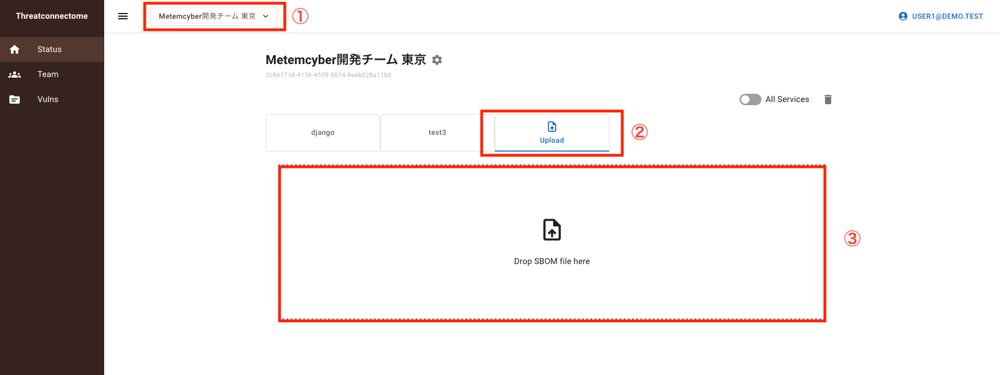
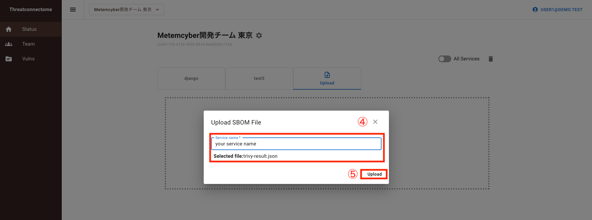
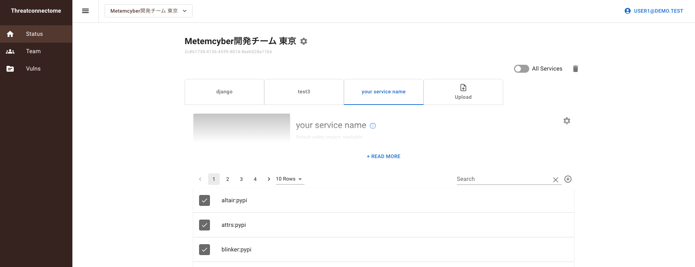

# :bulb: SBOM Registration

Purpose: To inspect packages (OS packages & library packages) used in a user's server by Trivy, register them with Threatconnectome and manage their security status.

## :bangbang: Requirements

- `Python3`
- `Trivy`

## :desktop_computer: Preparation

### Account creation

First of all, please make sure you have an account and belong to a team in Threatconnectome. If not, please create one.

For public environment: `http://threatconnectome.metemcyber.ntt.com`

For local environment: `http://localhost:<your_port_for_threatconnectome>`

### Update & Upgrade

Then update outdated packages and dependencies on your system.

```bash
sudo apt-get update && sudo apt-get upgrade
```

## :gear: Trivy Installation

Please run the commands below to install Trivy on Ubuntu:

```bash
sudo apt-get install wget apt-transport-https gnupg lsb-release
wget -qO - https://aquasecurity.github.io/trivy-repo/deb/public.key | gpg --dearmor | sudo tee /usr/share/keyrings/trivy.gpg > /dev/null
echo "deb [signed-by=/usr/share/keyrings/trivy.gpg] https://aquasecurity.github.io/trivy-repo/deb $(lsb_release -sc) main" | sudo tee -a /etc/apt/sources.list.d/trivy.list
sudo apt-get update
sudo apt-get install trivy
```

For users of other OS, please refer to `https://aquasecurity.github.io/trivy/v0.31.3/getting-started/installation/`

## :triangular_flag_on_post: Procedures for sbom registration

1. Run a full scan on all directories

```bash
sudo trivy fs -f cyclonedx -o trivy-result.json /
```

2. Upload Sbom file via Web UI

Login to `http://threatconnectome.metemcyber.ntt.com` and choose your team.
(In the case of public environment, for local environment use `http://localhost:<your_port_for_threatconnectome>`)
Navigate to the `Status` page and select `upload` tab. Then drag & drop the `trivy-result.json` file you created to the "Drop SBOM file here" area.

Once the Upload SBOM File modal opens, input your Service name in the provided field and click the `Upload` button to complete the registration process.




3. Verify registered content

After uploading, navigate back to the `Status` page where you can view the newly registered service.



# :bulb: Vuln Registration from TrivyDB

Purpose: To create vulns from TrivyDB to understand the threat impact of your packages.

## :pushpin: Requirements

```bash
pip install boltdb requests
```

## :triangular_flag_on_post: Usage

Run the following commands to update trivy.db

```bash
trivy image --download-db-only

```

The default path of `trivy.db` is as follows:

- Linux: `~/.cache/trivy/db/trivy.db`
- macOS: `~/Library/Caches/trivy/db/trivy.db`

Run the following commands to create vulns from Trivy DB:

The value of SYSTEM_API_KEY should match the value specified in the SYSTEM_API_KEY environment variable when starting the Threatconnectome.

```bash
export THREATCONNECTOME_REFRESHTOKEN="XXXXXXXXX"
export SYSTEM_API_KEY="XXXXXXXXX"
# For local development environment
python3 trivydb2tc.py -d ~/.cache/trivy/db/trivy.db "http://localhost/api"

```

Use `--force-update` option to update existing vulns.

```bash
python3 trivydb2tc.py -d ~/.cache/trivy/db/trivy.db --force-update "http://localhost/api"

```

# :bulb: Vuln Update from Vulnrichment

Purpose: To update vulns from Vulnrichment to regist exploitation and automatable in vuln.

## :triangular_flag_on_post: Usage

Run the following commands to clone vulnrichment

```bash
git clone https://github.com/cisagov/vulnrichment

```

Run the following commands to update vulns from vulnrichment:

The value of SYSTEM_API_KEY should match the value specified in the SYSTEM_API_KEY environment variable when starting the Threatconnectome.

```bash
export THREATCONNECTOME_REFRESHTOKEN="XXXXXXXXX"
export SYSTEM_API_KEY="XXXXXXXXX"
# For local development environment
python3 vulnrichment2tc.py -v vulnrichment "http://localhost/api"

```

# :bulb: Colletct tickets data

Run the following commands to collect tickets data

```bash
export THREATCONNECTOME_REFRESHTOKEN="XXXXXXXXX"
# For local development environment
python3 collect_tickets_data.py -p <pteam_id> -s <service_id> "http://localhost/api"

```

# :bulb: Safety impact registration from ImpactEstimator

Run the following commands to register the safety impact

```bash
export THREATCONNECTOME_REFRESHTOKEN="XXXXXXXXX"
# For local development environment
python3 impact_estimator2tc.py -d <tickets_data> -s <safety_impact> -p <process_safety_impact> "http://localhost/api"
```

## 🧾 Argument Descriptions

| Argument                  | Description                                                                            |
| ------------------------- | -------------------------------------------------------------------------------------- |
| `<tickets_data>`          | Path to the output file generated by `collect_tickets_data.py`.                        |
| `<safety_impact>`         | Path to the input data file used for estimation by `ImpactEstimator`.                  |
| `<process_safety_impact>` | Path to the result file generated by `ImpactEstimator` after safety impact estimation. |
